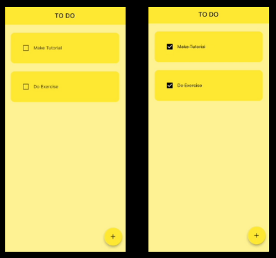

# 📝 To-Do List App com Hive


## 📝 Descrição

Este projeto é um aplicativo simples de **lista de tarefas (To-Do List)** desenvolvido em **Flutter**, utilizando o pacote **[Hive](https://pub.dev/packages/hive)** para **armazenamento local de dados**.  
O objetivo principal é **praticar a integração de banco de dados local em Flutter**, aplicando conceitos de CRUD e persistência offline.  
O projeto foi desenvolvido para fins de **aprendizado e experimentação prática** com armazenamento local.

## 🎥 Demonstração



## 🎯 Objetivo do Projeto

Aprender e consolidar conhecimentos em:

- Persistência de dados com **Hive**
- Criação de um app funcional de lista de tarefas
- Manipulação de dados locais (CRUD)
- Boas práticas na estruturação de estados e widgets

## ⚙️ Funcionalidades

* ✅ Adicionar tarefas  
* 🗑️ Remover tarefas  
* 💾 Armazenamento local com Hive (sem necessidade de internet)  
* 💡 Interface simples e intuitiva  

> Este projeto é voltado para **fins educacionais**, com foco em **armazenamento local** e **funcionalidade prática**.

## 🧠 Tecnologias

* **Flutter** 3.x  
* **Dart**  
* **Hive** – banco de dados local leve e rápido  
* **Hive Flutter** – integração do Hive com o Flutter  

## 🚀 Como executar

1. Clone este repositório

   ```bash
   git clone https://github.com/SeuUsuario/todo_list_hive.git
   ```
2. Acesse a pasta do projeto

   ```bash
   cd todo_list_hive
   ```
3. Instale as dependências

   ```bash
   flutter pub get
   ```
4. Execute o projeto

   ```bash
   flutter run
   ```

## 👨‍💻 Autor

**Thiago Valmir Cardoso**  
[LinkedIn](https://www.linkedin.com/in/thiago-valmir-cardoso) | [GitHub](https://github.com/ThiagoValmir)

## 📝 Licença

Este projeto é de uso livre para fins educacionais e de estudo.

## 📚 Créditos

Este projeto foi desenvolvido como parte do meu aprendizado em Flutter, acompanhando o seguinte tutorial:

🎥 **[Flutter Tutorial – To-Do List App using Hive Database](https://www.youtube.com/watch?v=mMgr47QBZWA)**  
